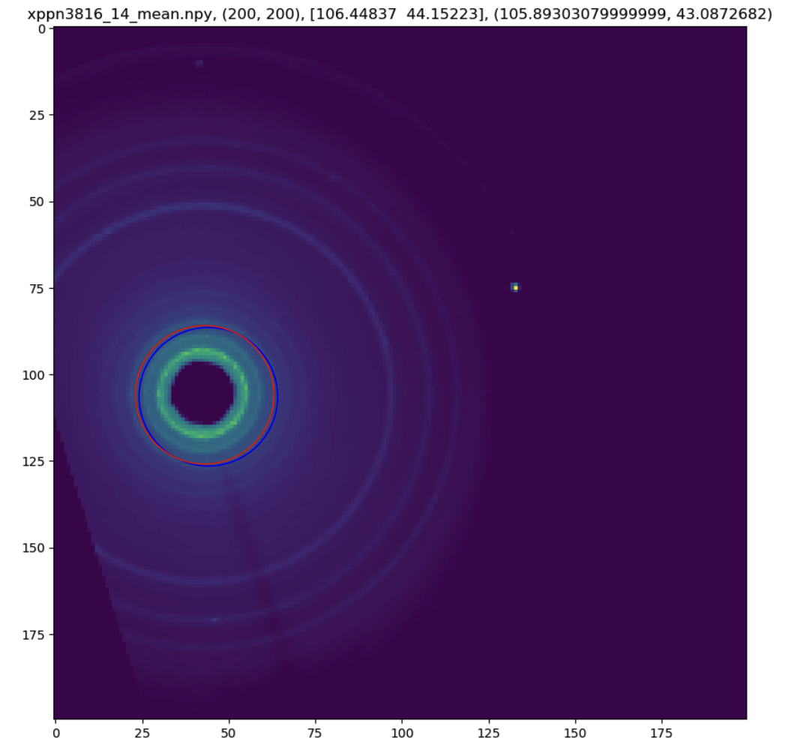

# BeamFinder

In this figure, the center of the blue circle indicates the predicted beam
position, whereas the center of the red circle is the label.  The circles are
used for visualization purpose only.  The neural network doesn't detector
specific circles.
